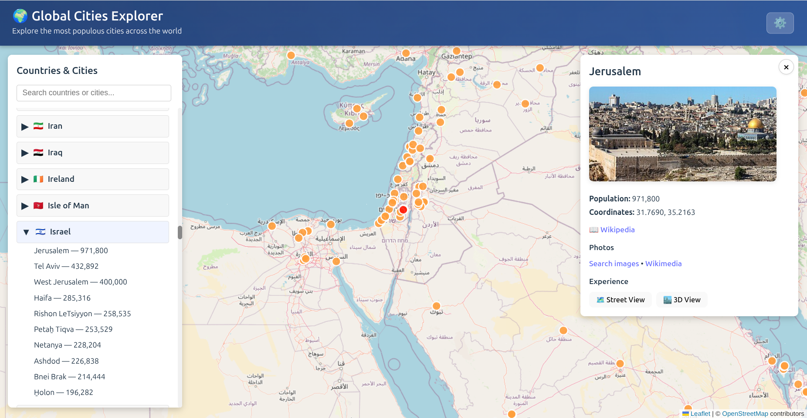

# 🌍 Global Cities Explorer

An interactive map application to explore the most populous cities across the world, built with React, TypeScript, and Leaflet.

  

## 📸 Screenshot



## ✨ Features

- **Interactive World Map** - Explore cities on a beautiful world map with smooth navigation
- **Comprehensive City Data** - Data for thousands of cities worldwide from GeoNames
- **Search & Filter** - Quickly find cities and countries with the search bar
- **City Details** - View population, coordinates, Wikipedia links, and images
- **Multiple Map Styles** - Choose between default (OpenStreetMap), satellite (ESRI), and terrain (OpenTopoMap) views
- **Responsive Design** - Optimized for desktop, tablet, and mobile devices
- **Customizable Settings** - Adjust markers, zoom behavior, and map styles
- **100% Free** - Uses only free, open-source tile providers (no API keys required!)

## 🚀 Live Demo

Visit the live demo: [https://pringithub.github.io/globe-cities](https://pringithub.github.io/globe-cities)

## 🛠️ Technologies

- **React 19** - Modern UI framework
- **TypeScript** - Type-safe development
- **Leaflet** - Open-source interactive map library
- **Vite** - Fast build tool and dev server
- **Wikipedia API** - Fetch city images and information
- **Free Tile Providers**:
  - OpenStreetMap (default)
  - ESRI World Imagery (satellite with labels)
  - OpenTopoMap (terrain)

## 📦 Installation

```bash
# Clone the repository
git clone https://github.com/pringithub/globe-cities.git
cd globe-cities

# Install dependencies
npm install
# or
yarn install

# Start development server
npm run dev
# or
yarn dev
```

The app will be available at `http://localhost:5173`

## 🌐 Deployment to GitHub Pages

This project is configured for easy deployment to GitHub Pages:

```bash
# Install gh-pages package (if not already installed)
npm install --save-dev gh-pages
# or
yarn add -D gh-pages

# Build and deploy
npm run deploy
# or
yarn deploy
```

The deploy script will:

1. Build the production bundle
2. Deploy to the `gh-pages` branch
3. Make the site available at `https://pringithub.github.io/globe-cities`

## 📁 Project Structure

```
globe-cities/
├── src/
│   ├── components/
│   │   ├── GlobeView.tsx      # Leaflet map component
│   │   ├── Sidebar.tsx         # Countries & cities navigation
│   │   ├── CityDetails.tsx     # City information panel
│   │   └── Settings.tsx        # Settings modal
│   ├── data/
│   │   └── cities.json         # City database
│   ├── App.tsx                 # Main application
│   ├── App.css                 # Global styles
│   └── main.tsx                # Entry point
├── generate_cities_json.py     # Script to update city data
└── package.json
```

## 🎮 Usage

1. **Browse Cities**: Use the sidebar to explore countries and their cities
2. **Search**: Type in the search bar to filter countries and cities
3. **Click Markers**: Click any city marker on the map to view details
4. **View Details**: See population, coordinates, images, and links
5. **Settings**: Click the ⚙️ icon to customize the experience
   - Change map styles (OpenStreetMap/Satellite/Terrain)
   - Toggle auto-zoom and markers
   - Adjust marker size

## 🔧 Settings

- **Map Style** - Choose between:
  - **Default**: OpenStreetMap (street view with labels)
  - **Satellite**: ESRI World Imagery with labels overlay
  - **Terrain**: OpenTopoMap (topographic view)
- **Auto-zoom** - Automatically zoom to cities when selected
- **Show Markers** - Toggle visibility of all city markers
- **Marker Size** - Adjust marker size (small/medium/large)

**All map styles are completely free and require no API keys!**

## 📊 Data Source

City data is sourced from [GeoNames](https://www.geonames.org/), a free geographical database. The dataset includes:

- City names and countries
- Geographic coordinates (latitude/longitude)
- Population figures
- Wikipedia links

To update the dataset, run the Python script:

```bash
python3 generate_cities_json.py
```

## 🤝 Contributing

Contributions are welcome! Please feel free to submit a Pull Request.

## 📝 License

This project is open source and available under the MIT License.

## 🙏 Acknowledgments

- [GeoNames](https://www.geonames.org/) for comprehensive city data
- [Leaflet](https://leafletjs.com/) for the interactive map
- [OpenStreetMap](https://www.openstreetmap.org/) contributors for map data
- [ESRI](https://www.esri.com/) for satellite imagery
- [OpenTopoMap](https://opentopomap.org/) for terrain maps
- [Stamen Design](http://stamen.com/) for map labels overlay
- [Wikipedia API](https://www.mediawiki.org/wiki/API) for city images
- [React](https://react.dev/) and [Vite](https://vitejs.dev/) for the framework

---

Made with ❤️ by [pringithub](https://github.com/pringithub)
